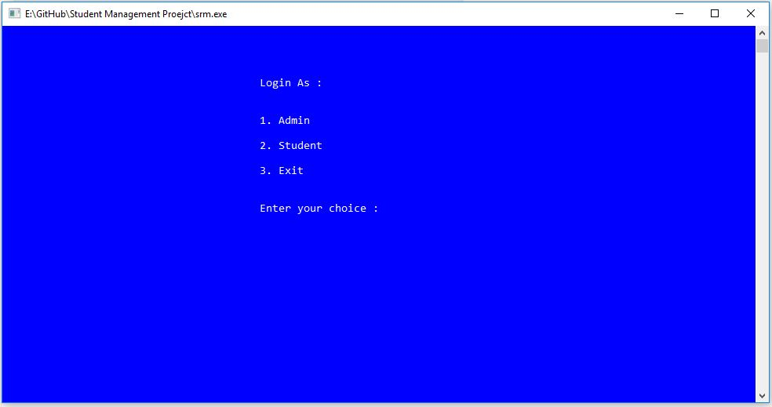
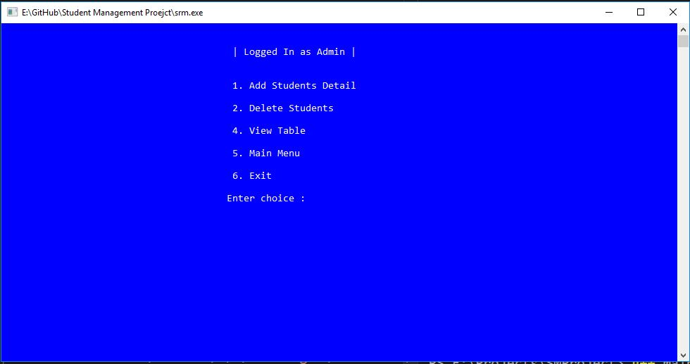
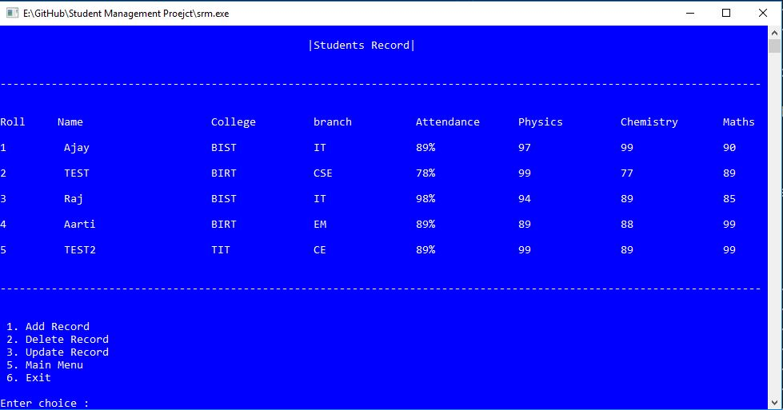
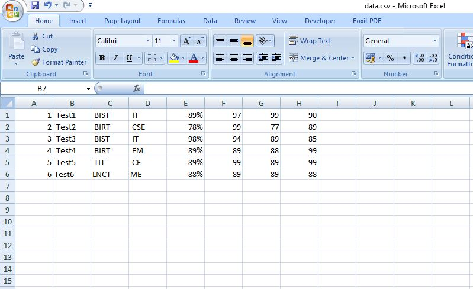

# Student Record Management System
A minimalist desktop app  to managae students record. **record are saved directly on an excel file to decrease data Entry labour cost**  and improves efficiency.

>launch the srm.exe file directly to use the App.

>for testing purpose both passwords are set to "password".

>Admin have full access to manipulate the data.

>Student account can only view the data.
## `Login`

## `Logged in as Admin`

## `Viewing Students Records`

## ``Records Saved in Excel File``

